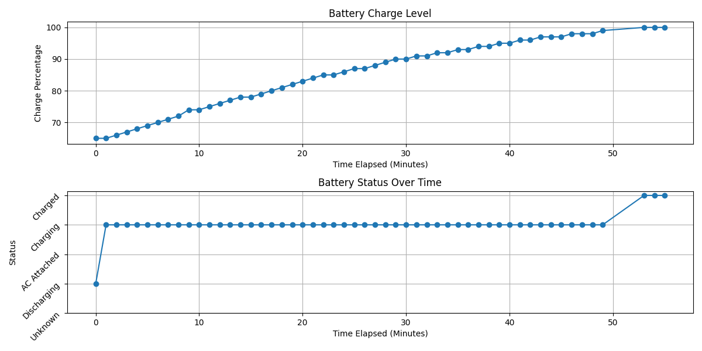

# macOS Battery Logging and Plotting Tools

This repository contains two Python scripts: `log_power.py` and `plot_results.py`. These scripts are designed to log and visualize macOS battery status over time.

## `log_power.py`

### Description

`log_power.py` is a command-line tool that logs macOS battery status (percentage and charging state) to a CSV file at a specified interval. It uses the `pmset` command to retrieve battery information.

### Features

-   Logs battery percentage and status (Discharging, Charging, Charged, AC Attached, Unknown).
-   Customizable logging interval.
-   Output to a user-specified CSV file or a timestamped default file.
-   Provides clear console output during the logging process.
-   Gracefully handles `KeyboardInterrupt` (Ctrl+C) for stopping the logging.

### Usage

```
python log_power.py [-f FILE] [-i SECONDS]
```

**Options:**

-   `-f FILE`, `--file FILE`: Path to the output CSV file. If not provided, a timestamped default file will be created (e.g., `battery_log_20231027_143000.csv`).
-   `-i SECONDS`, `--interval SECONDS`: Logging interval in seconds. Default is 60 seconds.

**Examples:**

```bash
# Log to the default file with a 60-second interval
python log_power.py

# Log to a custom file named 'my_battery_log.csv' with a 120-second interval
python log_power.py -f my_battery_log.csv -i 120
```

### Output

The CSV file will have the following columns:

-   `Timestamp`: ISO formatted timestamp of when the data was logged.
-   `Percentage`: The current battery percentage (0-100).
-   `Status`: An integer code representing the battery status:
    -   0: Unknown
    -   1: Discharging
    -   2: AC Attached
    -   3: Charging
    -   4: Charged

## `plot_results.py`

### Description

`plot_results.py` is a tool for visualizing data logged by `log_power.py`. It reads the CSV data and plots the battery percentage and status over time.

### Features

-   Plots battery percentage over time.
-   Plots battery status over time.
-   Supports using elapsed time from start of logging or absolute timestamps for x-axis
-   Supports specifying different time units for elapsed time
-   Displays both plots in one figure

### Usage

```
python plot_results.py FILE [-e] [-u {hours,minutes,seconds}]
```

**Arguments:**

-   `FILE`: Path to the battery log CSV file.

**Options:**

-   `-e`, `--elapsed`: Use elapsed time instead of absolute timestamps for the X-axis
-   `-u {hours,minutes,seconds}`, `--unit {hours,minutes,seconds}`: Time unit for the elapsed time (default is hours).

**Examples:**

```
# Plot data using timestamps
python plot_results.py battery_log_20231027_143000.csv

# Plot using elapsed time in minutes
python plot_results.py battery_log_20231027_143000.csv -e -u minutes
```

### Output

The script will generate a matplotlib plot. The first subplot will show battery percentage over time. The second subplot will display battery status over time, with clear labels.



## Dependencies

-   pandas
-   matplotlib

You can install the required packages using pip:

```
pip install pandas matplotlib
```

